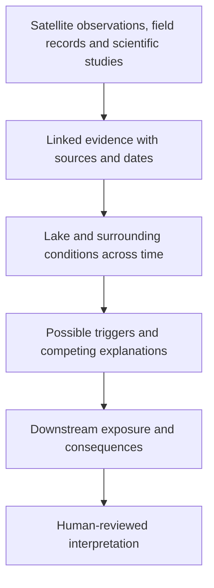

# Climate Risk Intelligence Commons

### Climate-risk intelligence we can build together.

[](https://github.com/Climate-Risk-Intelligence-Commons/cric-core/actions/workflows/ci.yml)
[](LICENSE)

**Understand the evidence. See what changed. Build on what we learn.**

Understanding climate risk means connecting observations, scientific studies and
models with the places and people exposed to harm. Those connections need to remain
visible as evidence changes and understanding improves.

**Climate Risk Intelligence Commons (CRIC)** is building open infrastructure for
that work: a shared foundation for connecting evidence, examining uncertainty,
reproducing analyses and contributing knowledge others can build upon.

Our ambition is a **durable scientific memory for climate risk**—one that preserves
what we knew, explains what changed, and keeps unresolved questions open to investigation.

Whether you care about climate change and disasters, study their causes and
consequences, work with affected communities, or build scientific software, there
is a place to begin here.

> **Project stage: early development.** The vision below describes the CRIC ecosystem
> we are building. This repository, `cric-core`, contains its shared foundations and
> product specifications. See [what exists today](#what-exists-today) for implemented
> capabilities.

[Why CRIC](#why-a-climate-risk-commons) ·
[First application](#starting-with-glacial-lake-outburst-floods) ·
[How it works](#how-the-pieces-fit) ·
[Get involved](#help-build-the-commons) ·
[Developer setup](#for-developers)

---

## Why a climate-risk commons?

An assessment becomes more useful when another person can examine its sources,
understand its assumptions and build on the work. CRIC's purpose is to make those
connections part of the infrastructure of climate-risk research.

We want people to be able to ask:

- **What evidence supports this assessment?** Follow a conclusion back to its
  observations, sources and calculations.
- **What did we know at the time?** Reconstruct an earlier assessment without
  silently adding discoveries made later.
- **Where do sources disagree?** Examine competing explanations alongside the
  evidence supporting each.
- **What is missing?** See gaps and uncertainty explicitly; a lack of observations
  must never become an assumption of low risk.
- **Can someone else reproduce this?** Recover the data, methods and versions
  behind an analysis.

**Commons** means building a shared resource that others can inspect, challenge,
extend and reuse. CRIC's published specifications, software, contribution process
and decision records make that work open to participation. Source datasets retain
their own licensing and access conditions.

Read the [vision and principles](docs/CRIC-PRD-v0.1/product/Product-Vision-and-Principles.md).

## Starting with glacial lake outburst floods

Our first application is **cryosphere risk**: risk involving Earth's snow, ice and
frozen ground. We begin with Himalayan **glacial lake outburst floods (GLOFs)**,
floods caused by a sudden release of water from a glacial lake.

This first domain brings together changing landscapes, observations across time,
possible cascading triggers and downstream exposure. It gives us a concrete way
to develop and test the wider architecture.

### Follow one question through the evidence

*Illustrative research workflow, planned for CRIC:*

> How did a glacial lake change before an outburst, what evidence supports the
> proposed trigger, and which settlements and infrastructure lay downstream?



A researcher should be able to move through that chain and inspect the evidence
behind each step. Where records are missing, CRIC should show the gap. Where
studies disagree, it should preserve both claims. When new evidence changes the
interpretation, earlier knowledge should remain retrievable.

The planned **Event Cube** brings together records from before, during and after
an event, linked to sources, claims and consequences. It is designed to support
historical reconstruction and reproducible model experiments, including controls
that keep information discovered after an event out of predictive training inputs.

Explore the [Event Cube specification](docs/CRIC-PRD-v0.1/domains/StateSnapshot-and-Event-Cube-Specification.md).

### Built to extend across hazards

The shared foundation is designed to support future work on floods, droughts,
landslides, wildfire, heat, coastal hazards and their interactions. These are
**intended extensions**, not claims of current coverage.

The architecture separates shared climate-risk concepts from specialised domain
packages, so a future hazard domain can build on CRIC without installing the
cryosphere or GLOF packages.

## What makes CRIC distinctive?

These are design commitments across the planned ecosystem:

| Commitment | What it means for the person using CRIC |
|---|---|
| **Evidence stays connected** | Provenance—the record of where information came from and how it was transformed—travels with derived results. |
| **History remains inspectable** | New knowledge can supersede earlier interpretations without erasing the accepted record. |
| **Uncertainty is visible** | Missing, disputed and incomplete information remains explicit. |
| **Disagreement has a place** | Conflicting scientific claims can coexist with their supporting evidence. |
| **People and software share a foundation** | Knowledge is designed to be readable by humans and usable by software and AI agents. |
| **Components remain replaceable** | The architecture avoids requiring one database, model provider, cloud or agent framework. |
| **Human judgement has a defined role** | Oversight increases with uncertainty, consequence and the authority an action would exercise. |

AI agents are planned participants in this system. They will use defined tools,
permissions and structured outputs. Deterministic software retrieves and assembles
the evidence before a language model interprets it.

The [Master PRD](docs/CRIC-PRD-v0.1/CRIC-PRD-MASTER.md) sets out the full
constitutional rules.

## How the pieces fit

CRIC brings together several reusable parts. **This is the target architecture;
the implementation starts with the core.**

| Part | Purpose | Explore |
|---|---|---|
| **Core and shared vocabulary** | Common identifiers, schemas and concepts for describing hazards, exposure and consequences | [Domain architecture](docs/CRIC-PRD-v0.1/product/Product-Scope-and-Domain-Architecture.md) |
| **Evidence and Data Commons** | Source catalogues, ingestion, licensing and data quality | [Data architecture](docs/CRIC-PRD-v0.1/data/Data-Commons-Architecture.md) |
| **Knowledge Commons** | Connected evidence, claims, uncertainty and history in a knowledge graph | [Knowledge specification](docs/CRIC-PRD-v0.1/knowledge/OKF-Knowledge-Graph-Specification.md) |
| **Domain packages** | Specialised concepts for cryosphere and GLOF research, with other hazards to follow | [Cryosphere](docs/CRIC-PRD-v0.1/domains/Cryosphere-Ontology.md) |
| **Computation, agents and models** | Reproducible calculations, reusable AI workflows and model evaluation | [Retrieval](docs/CRIC-PRD-v0.1/engineering/Deterministic-Retrieval-Engine-Specification.md) · [Agents](docs/CRIC-PRD-v0.1/ai/Agent-Commons-Architecture.md) · [Models](docs/CRIC-PRD-v0.1/ai/Model-Commons-and-ML-Specification.md) |
| **Interfaces and human review** | Search, APIs, research workbenches and review workflows | [Human applications](docs/CRIC-PRD-v0.1/interfaces/Human-Applications-and-UI.md) · [Human oversight](docs/CRIC-PRD-v0.1/ai/Responsible-Autonomy-and-HITL.md) |

A **knowledge graph** records information and the relationships between it—for
example, which observation supports a claim, which lake an observation describes,
or which calculation produced a model input. CRIC's Knowledge Commons is a product
in its own right, intended to support research as well as downstream tools.

### The role of this repository

`cric-core` defines the shared identifiers, schemas and versioning rules used
throughout the repository family. In the architecture, every other CRIC repository
depends on this one; **the core may not depend on a domain-specific repository**.

The [Master PRD](docs/CRIC-PRD-v0.1/CRIC-PRD-MASTER.md) maps the specifications.
The [implementation sequence](docs/CRIC-PRD-v0.1/CRIC-Repository-Dependency-and-Implementation-Sequence.md)
maps the planned repository family and its dependencies.

## What exists today

The project is building its foundations. Available in this repository:

- An installable [Python package](pyproject.toml).
- Implemented [identifier validation](src/cric_core/identifiers/__init__.py).
- Implemented [knowledge-state vocabulary and transition rules](src/cric_core/knowledge_state/__init__.py),
  including rules governing the origin and entry state of review decisions.
- [Automated checks](https://github.com/Climate-Risk-Intelligence-Commons/cric-core/actions/workflows/ci.yml)
  for linting, types, tests and package builds.
- Published product specifications, [architecture decisions](docs/DECISION_REGISTER.md)
  and an [open-questions register](docs/OPEN_QUESTIONS.md).

The complete evidence-to-analysis workflow, reference Event Cubes, model pipelines,
agent workflows and public research interfaces remain planned work. Installing
`cric-core` gives you the foundational package; it does not launch that ecosystem.

See [Project Facts](docs/PROJECT_FACTS.md) for dated implementation records and
[GitHub Actions](https://github.com/Climate-Risk-Intelligence-Commons/cric-core/actions/workflows/ci.yml)
for build results.

### Where we are going

The implementation follows dependencies:

1. **Establish shared foundations** — identifiers, schemas, time, provenance and validation.
2. **Connect knowledge and data** — the knowledge graph, source catalogues, domain records and reproducible ingestion.
3. **Make research workflows reproducible** — retrieval, human review, agents and reference Event Cubes.
4. **Build and evaluate models** — traceable training samples, baseline models and documented limitations.
5. **Open up exploration** — APIs, research interfaces and a coordinated reference release.

The v0.1 milestone is concrete: an external researcher can reproduce a reference
GLOF Event Cube, run a baseline model, trace its output to original evidence and
inspect uncertainty and human review.

These are milestones rather than delivery-date promises.
[Read the full sequence and acceptance criteria](docs/CRIC-PRD-v0.1/CRIC-Repository-Dependency-and-Implementation-Sequence.md).

> **Research scope:** CRIC v0.1 and v0.2 are research and reference implementations
> unless separately validated and authorised for operational use. Model and agent
> outputs are not official warnings. Emergency decisions and warning authority
> remain with competent institutions.

## Help build the commons

**You do not need to write code to contribute.** Clear explanations, well-sourced
evidence, careful review and useful questions all help build a stronger foundation.

| Your interest | A useful place to start |
|---|---|
| **Climate change and disasters** | Read the vision, follow development, and flag confusing explanations or questions the documentation should answer. |
| **Education and communication** | Help make terminology and research workflows understandable to a wider audience. |
| **Science and disaster-risk practice** | Propose source material, review scientific concepts or describe a research question CRIC should support. |
| **Data and mapping** | Suggest datasets with source and licensing information, or identify gaps in quality and coverage. |
| **Software, AI and modelling** | Explore the core package, review the specifications, or help develop validation and reproducible workflows. |
| **Research institutions and resourcing partners** | Discuss collaboration, domain expertise, reference studies or support for open infrastructure. |

For a first contribution, [browse the issues](https://github.com/Climate-Risk-Intelligence-Commons/cric-core/issues)
or [open a proposal](https://github.com/Climate-Risk-Intelligence-Commons/cric-core/issues/new).
Describe the question or improvement, explain why it matters, and include sources
where relevant. Some contribution types depend on infrastructure still being built;
an issue is a useful starting point for scoping that work.

Read [Contributing](CONTRIBUTING.md), [Governance](GOVERNANCE.md) and our
[Code of Conduct](CODE_OF_CONDUCT.md). Scientific and data contributions require
appropriate evidence, licensing and review. Report vulnerabilities through the
[security process](SECURITY.md).

You can also **star the repository** to help others discover it, or **watch it**
on GitHub to follow development.

## For developers

Requires **Python 3.12 or later**. To install the foundational package from source:

```sh
git clone https://github.com/Climate-Risk-Intelligence-Commons/cric-core.git
cd cric-core
python3 -m venv .venv
source .venv/bin/activate
python -m pip install -e ".[dev]"
python -m pytest
```

The activation command above is for bash/zsh. On Windows PowerShell, use
`.venv\Scripts\Activate.ps1`.

Before preparing a change, read [Contributing](CONTRIBUTING.md).
Coding-agent sessions should also read [CLAUDE.md](CLAUDE.md) and [AGENTS.md](AGENTS.md).

## Talk to us

For research collaboration, institutional partnership or funding discussions:

**Eyekyam Risk Resolutions**  
507, 5th Floor, Nirvana Courtyard, Sector 50, Gurgaon, Haryana – 122018

- [ashley@eyekyam.com](mailto:ashley@eyekyam.com) — CTO
- [vidya@eyekyam.com](mailto:vidya@eyekyam.com) — CEO

## Licence

`cric-core` is licensed under **AGPL-3.0**. See [LICENSE](LICENSE).

---

**Help make climate-risk knowledge something we can inspect, share and build upon—together.**
